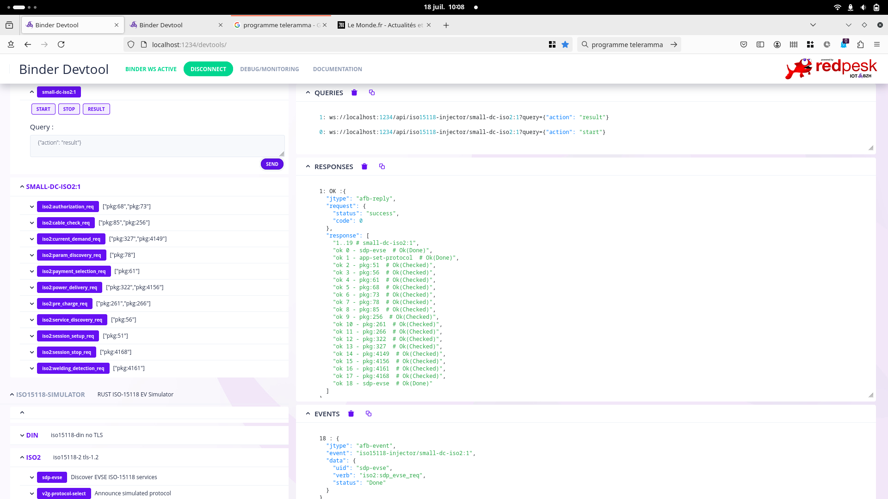
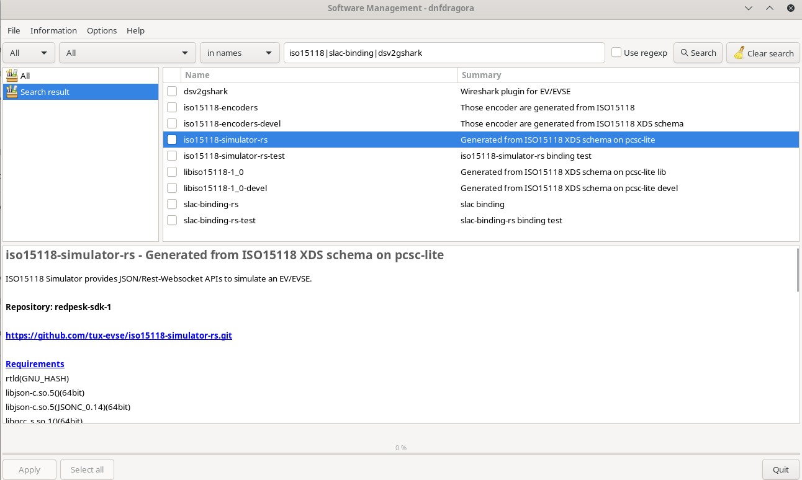

# ISO15118 Simulator provides JSON/Rest-Websocket APIs to simulate an EV/EVSE

Provide a JSON Afb-V4 api to ISO15118-encoders. Each ISO message is exposed a Afb-V4 RPCs. In EV mode the simulator start sending an SDP discovery multi-cast message in IPV6 to configured interface and establishes a TCP/TLS connection to start ISO dialogue.

 

## Quick video introduction to Tux-Evse Open Source iso15118-simulator

<https://player.vimeo.com/video/1004557448>

## Binary packages

Binary packages are available for Fedora/OpenSuSE/Ubuntu stable and previous-stable versions. *Expect for Cargo+Cmake expert compiling the iso15118-simulator is not as simple as it should. The simulator+dependencies contains 40000 lines of Rust and has multiple C dependencies that recursively pull new dependencies.*

For quick start it is recommended to also install on top of iso15118-simulator-rs:

* iso15118-simulator-rs-test: contains some sample config & scenario
* dsv2gshark: wireshark iso15118 plugin

```bash
wget https://raw.githubusercontent.com/redpesk-devtools/redpesk-sdk-tools/master/install-redpesk-sdk.sh
bash install-redpesk-sdk.sh --no-recommends
sudo dnf/zypper/apt install iso15118-simulator-rs
sudo dnf/zypper/apt install iso15118-simulator-rs-test
sudo dnf/zypper/apt install dsv2gshark
```

After declaring redpesk-sdk repositories, you should see iso15118 package from your preferred package management tool.


Note: For manual binary packages directly from repository check: <https://download.redpesk.bzh/redpesk-lts/batz-2.0-update/sdk-third-party/>

## Network configuration

To run the simulator **binding-start-evcc** you need some network interfaces

```bash
ip link show evse-tun // a bridge
ip link show evse-veth
ip link show evcc-veth
```

A script can help you to configure the network interfaces.

```bash
sudo client-server-bridge
```

Note: **binding-start-evcc** has an option to overwrite the **evcc-veth** value

```bash
binding-start-evcc --help
...
-i|--iface       specify the network interface (default:"evcc-veth")
...
```

## GnuTLS certificate configuration

To run the simulator **binding-start-evcc** you need some GnuTLS certificate.

A script can help you to configure the GnuTLS certificate.

```bash
mkcerts -i ./temp
```

## Run EVCC(vehicle) simulator after package installation

Now, select a scenario and run the simulator:

```bash
binding-start-evcc --pki_tls_sim_dir ./temp/ --scenario_file /usr/share/iso15118-simulator-rs/audi-dc-iso2-compact.json
```

You can use a prebuild configuration without tls/pki:

```bash
binding-start-evcc --simulation_conf /usr/share/iso15118-simulator-rs/binding-simu15118-evcc-no-tls.yaml --scenario_file /usr/share/iso15118-simulator-rs/audi-dc-iso2-compact.json
```

## Run EVSE(charger) simulator after package installation

Now, select a scenario and run the responder:

```bash
binding-start-evse --pki_tls_sim_dir ./temp/ --scenario_file  /usr/share/iso15118-simulator-rs/audi-dc-iso2-compact.json
```

You can use a prebuild configuration without tls/pki:

```bash
binding-start-evse --simulation_conf /usr/share/iso15118-simulator-rs/binding-simu15118-evse-no-tls.yaml --scenario_file /usr/share/iso15118-simulator-rs/audi-dc-iso2-compact.json
```

## Quick start (simulating both EVSE+EVCC)

```bash
# register redpesk/tuxevse repository and install packages
  wget https://raw.githubusercontent.com/redpesk-devtools/redpesk-sdk-tools/master/install-redpesk-sdk.sh && sh install-redpesk-sdk.sh --no-recommends
  sudo dnf/zypper/apt install iso15118-simulator-rs iso15118-simulator-rs-test
# implement virtual network, create certificate and start both vehicle and charger simulation on a scenario
  sudo client-server-bridge # Create virtual network
  mkcerts -i ./temp ;# Create dev certificate
  binding-start-evcc --pki_tls_sim_dir ./temp/ --scenario_file /usr/share/iso15118-simulator-rs/audi-dc-iso2-compact.json ;# Start vehicle simulation(injector)
  binding-start-evse --pki_tls_sim_dir ./temp/ --scenario_file  /usr/share/iso15118-simulator-rs/audi-dc-iso2-compact.json ;# Start charger simulator(responder)
# connect on vehicle webui simulator to start choosen scenario
  xdg-open http://localhost:1234/devtools/ ;#(Click on audi-dc-iso2:1:0 -> EXEC & SEND)
```

## Test the binder with Podman

Use podman to test the binders without installing any thing (if you use docker, just replace every "podman" by "docker").

If you don't have the tool "client-server-bridge" just do:

```bash
wget https://raw.githubusercontent.com/tux-evse/iso15118-simulator-rs/refs/heads/main/afb-test/network/client-server-bridge.sh
chmod a+x ./client-server-bridge.sh
sudo ./client-server-bridge.sh
```

Open a terminal and run:

```bash
podman run --rm --name podman_evcc --network=host --cap-add=NET_ADMIN -it registry.redpesk.bzh/tux-evse/afb-iso15118:v0.1  bash -c "binding-start-evcc --simulation_conf /usr/share/iso15118-simulator-rs/binding-simu15118-evcc-no-tls.yaml --scenario_file /usr/share/iso15118-simulator-rs/audi-dc-iso2-compact.json --no-clean"
```

Open an other terminal and run:

```bash
podman run --rm --name podman_evse --network=host --cap-add=NET_ADMIN -it registry.redpesk.bzh/tux-evse/afb-iso15118:v0.1  bash -c "binding-start-evse --simulation_conf /usr/share/iso15118-simulator-rs/binding-simu15118-evse-no-tls.yaml --scenario_file /usr/share/iso15118-simulator-rs/audi-dc-iso2-compact.json --no-clean"
```

Now open your browser <http://localhost:1234/devtools/>:

```bash
xdg-open http://localhost:1234/devtools/
```

And click on **audi-dc-iso2:1:0 -> EXEC & SEND**

PS: if you have some troubles with your firewall, don't forget to configure it or disable it for the test.

```yaml
0: ERROR :{
  "jtype": "afb-reply",
  "request": {
    "status": "internal-error",
    "info": "{\"uid\":\"job_transaction_cb\",
\"info\":\"unexpected status for uid:sdp-evse count:0\"}",
    "code": -100
  }
}
```

If you use **firewalld** as firewall, a solution can be:

```bash
sudo firewall-cmd --zone=trusted --add-interface=evse-tun;
```

## Open the devtools

You can open the simulator devtools interface with:

```bash
xdg-open http://localhost:1234/devtools/
```

You can open the responder devtools interface with:

```bash
xdg-open http://localhost:1235/devtools/
```

## Dependencies

* <https://github.com/tux-evse/iso15118-encoders-rs>
* <https://github.com/redpesk-common/afb-librust>

## Compilation

```bash
    cargo add --git https://github.com/redpesk-common/afb-librust afbv4 --optional
```

## Run from development tree

```bash
export CARGO_BINDING_DIR=~/.cargo/build/debug/; export INJECTOR_BINDING_DIR=~/.cargo/build/debug/

./afb-evcc/etc/binding-start-evcc.sh -f ./afb-test/etc/audi-dc-iso2-minimal.json -m ./afb-evcc/etc/binding-simu15118-evcc-no-tls.yaml

./afb-evse/etc/binding-start-evse.sh -f ./afb-test/etc/audi-dc-iso2-minimal.json -m ./afb-evse/etc/binding-simu15118-evse-no-tls.yaml
```


## OCI container (podman/docker)

```bash
cd oci-15118
podman build -t afb-iso15118 -f Dockerfile
```

## Configuration

Configuration relies on standard binding/binder json/yaml config file. The config splits into three main part:

* Iso stack to load 15118-2, 15118-20, Din, SLAC, ...
* Network/TLS: defined the interface to use as well as TLS certificates.
* Verbs: defines which ISO message should be exposed.

**Interface to service discovery** prefix allows to select the interface IPV6  to be used. 0xFE80 is the default for ipv6 local-link.

```yaml
iface: ${IFACE_SIMU}   # default lo
ip6_prefix:  0         # default 0xFE80
sdp_port:    15118     # default 15118
```

**TLS configuration** optional pin is private key's password. psklog_in a user defined filepath for Wireshark pre-shared-key. PSK allows to introspect crypt TLS communication from wireshark UI as if it was a clear text TCP channel.

```yaml
    trust: ${PKI_TLS_DIR}/_trialog/
    certs: ${PKI_TLS_DIR}/_trialog/secc-chain.pem
    key: ${PKI_TLS_DIR}/_trialog/secc20Cert.key
    pin: 123456
    proto: SECURE128:-VERS-SSL3.0:-VERS-TLS1.0:-ARCFOUR-128:+PSK:+DHE-PSK
    psk_log: /tmp/tls-keys-simu.log
```

**Api Json/Yaml** input query as well as response use JSOn, but configuration on top of JSON also accept YAML.

* iso15118-2 Requests
  * [json](iso15118-2/docs/api-req.json)
  * [yaml](iso15118-2/docs/api-req.yaml)
* iso15118-2 Responses
  * [json](iso15118-2/docs/api-res.json)
  * [yaml](iso15118-2/docs/api-res.yaml)

## Debug

To introspect iso15118  trace use dsv2shark wireshark plugin with nss-key-log master keys.

Plugin:

* source: <https://github.com/dspace-group/dsV2Gshark>
* binary Linux packages: dnf/zypper/apt install dsv2gshark

Using NSS-KEY-LOG master key file to decrypt TLS with wireshark

```bash
wireshark iso15118-binding-rs/afb-test/trace-logs/hello2-tls-1.3.pcapng -o tls.keylog_file:iso15118-binding-rs/afb-test/trace-logs/hello2-tls-1.3.keylog
```

Using socat to check tls server config

```bash
socat -6 "OPENSSL-CONNECT:[fe80::ac52:27ff:fef3:d0d7%evcc-veth]:64109,snihost=xxx,verify=0" stdio
```

## Current development status

This module is under deep development. Initial version supports ISO-2, the other stacks (Iso-20, Din) will come as soon as iso15118-encoder-rs implements them.

## Usage

The simulator might be used in standalone mode to in conjunction with injector-binding-rs to automate testing scenarios.

## Test

```bash
cargo test --package iso15118-2 --lib -- encoders_test --show-output
```

## Scenarios files

You may generate your scenarios directly from pcap/pcapng tcpdump files. You may find few pcap sample into afb-test/trace-logs directory and many more from <https://github.com/EVerest/logfiles.git> where every '*.dump' file uses pcap/wireshark syntax.

Command line

```bash
pcap-iso15118 --pcap_in=./afb-test/trace-logs/audi-dc-iso2.pcap --json_out==/tmp/iso15118-scenario.json --compact=basic
```

--compact:
 * none: extract and replay every requests (expect exact response match for every request)
 * basic: only play once each unique request+query  (as none expect exact response match)
 * strong: only play once unique unique request(independently on query values). Loop on reuqest until receiving expected answer.

Note: in minimal mode pcap-iso15118 by default only check "rcode" values. It is user responsibility to to add in expected fields in scenario file (usually taken from response field)

Output file

```jsonc
{
  "uid":"./afb-test/trace-logs/abb-normal-din.pcap",
  "info":"/tmp/iso15118-scenario.json",
  "api":"pcap-simu",
  "path":"${CARGO_TARGET_DIR}debug/libafb_iso15118_simulator.so",
  "scenarios":[
    {
      "uid":"scenario-1",
      "target":"iso15118-din",
      "transactions":[
        {
          "uid":"pkg:42",
          "verb":"session_setup_req",
          "delay":16,
          "query":{
            "id":"[02,01,02,03,04,02]",
            "tagid":"session_setup_req"
          },
          "expect":{
            "id":"[00]",
            "rcode":"ok",
            "stamp":0,
            "tagid":"session_setup_res"
          }
        },
        {
          "uid":"pkg:46",
          "verb":"service_discovery_req",
          "delay":12,
          "query":{
            "category":"ev_charger",
            "tagid":"service_discovery_req"
          },
          "expect":{
            "rcode":"ok",
            "charging":{
              "tag":{
                "id":1,
                "category":"ev_charger"
              },
              "transfer":"dc_extended",
              "isfree":false
            },
            "payments":[
              "external"
            ],
            "tagid":"service_discovery_res"
          }
        },
      ],
    }
  ]
}
```
